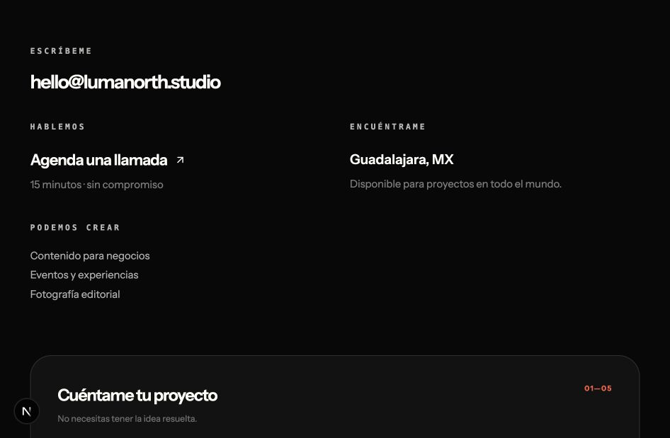
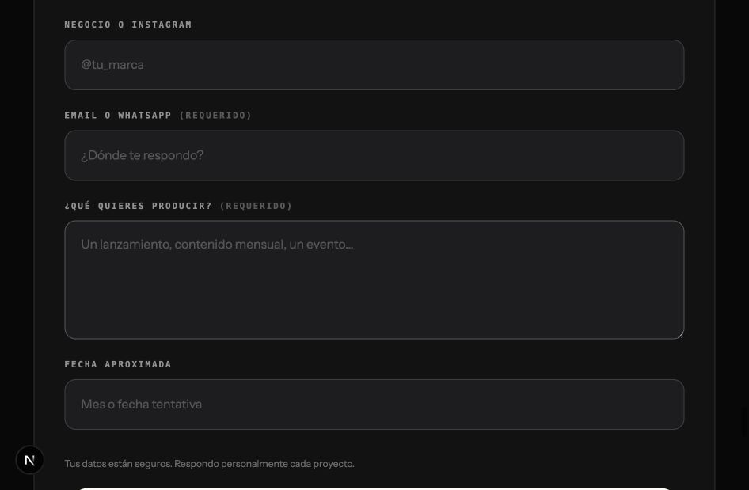
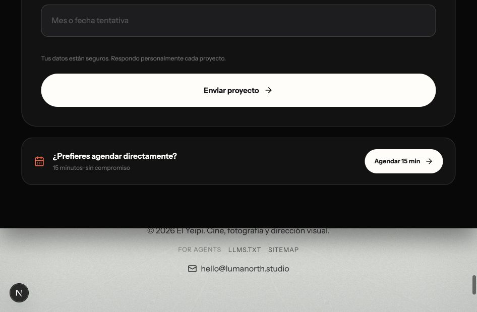
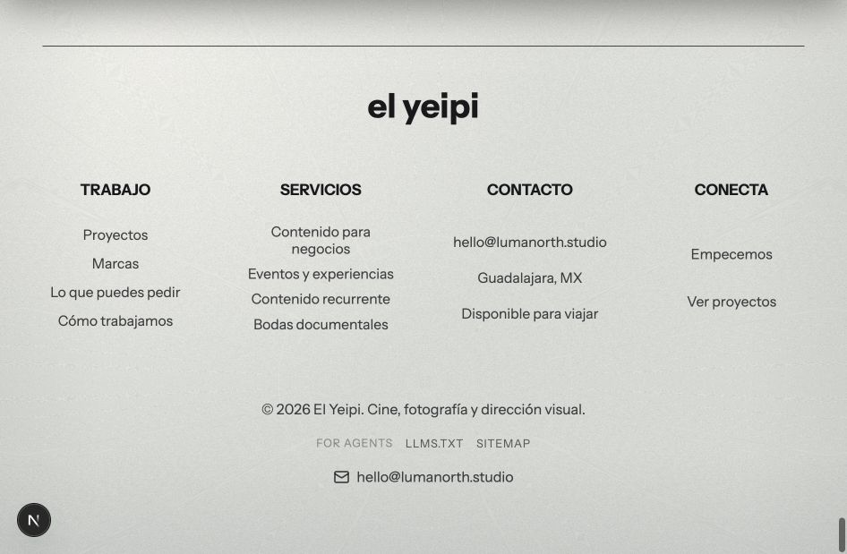
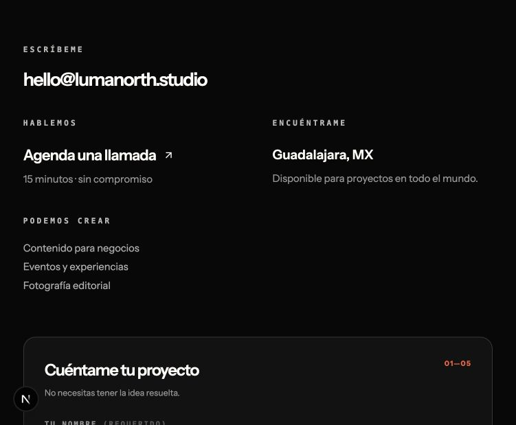
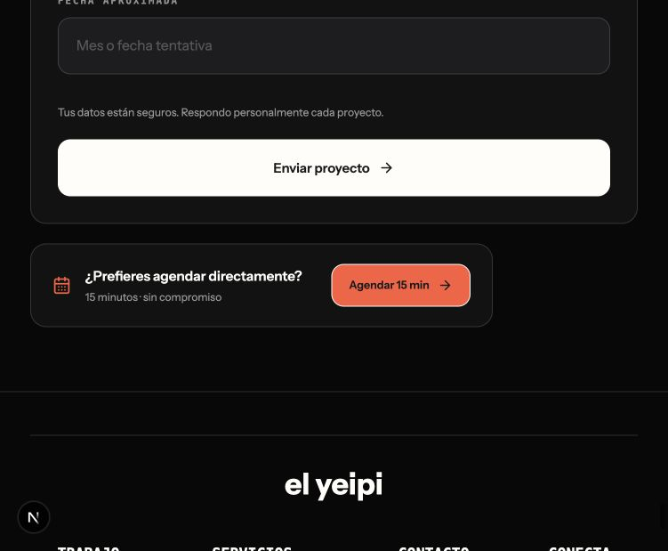
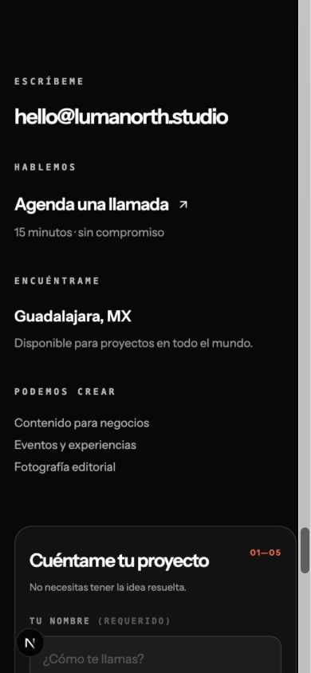

# Auditoría de consistencia — contacto y footer

## Alcance

Revisión combinada de UX, diseño y riesgos visibles de accesibilidad en el cierre del funnel: información de contacto, formulario, acciones y footer.

## Objetivo del usuario

Entender rápidamente cómo contactar a Yeipi, completar un brief corto o elegir la alternativa de agendar una llamada sin que el sistema visual cambie de lenguaje entre componentes.

## Pasos auditados

### 1. Entrada a contacto — salud: buena con inconsistencias menores

- La jerarquía de información a la izquierda y formulario a la derecha se entiende.
- Los overlines uppercase funcionan como etiquetas, pero los pesos tipográficos no pertenecían a una escala definida.
- El ancho exterior del contacto no coincidía con el ancho del footer.

### 2. Lectura y llenado del formulario — salud: buena base

- Los campos comparten borde, altura y padding.
- Las etiquetas usan uppercase y monoespaciada de forma coherente.
- El sistema mezclaba pesos 520, 620 y 680 con cuerpo 400, dificultando reconocer una jerarquía repetible.
- El texto auxiliar tenía contraste visual bajo por su tamaño y opacidad.

### 3. Elección de acción — salud: necesita normalización

- El botón primario y la acción de agenda eran píldoras, mientras los inputs utilizaban esquinas de 14 px.
- La diferencia de radios hacía parecer que pertenecían a otra librería de componentes.
- El salto inmediato de negro a un footer claro con textura interrumpía el cierre del funnel.

### 4. Footer — salud: funcional, visualmente desconectado

- La navegación y agrupación semántica están claras.
- El gradiente claro y el grano competían con el CTA oscuro anterior.
- Los enlaces mantienen sentence case, pero títulos, marca y metadatos no estaban documentados como reglas explícitas.

## Cambios aplicados

- Escala tipográfica limitada a 400, 600 y 700.
- Instrument Sans para display, cuerpo y acciones; monoespaciada únicamente para etiquetas y metadatos.
- Uppercase para labels y metadatos; lowercase para la marca; sentence case para títulos, cuerpo, campos y acciones.
- Radio de 14 px para controles y 18 px para paneles.
- Un mismo borde oscuro, gutter y ancho máximo para contacto y footer.
- Fondos oscuros planos y continuidad visual entre contacto y footer.
- Contraste reforzado en texto auxiliar y foco visible en acciones y enlaces.

## Resultado implementado

- Contacto y footer comparten `max-width: 1480px` y el mismo gutter responsivo.
- Inputs y botones comparten radio de 14 px; los paneles usan 18 px.
- Los pesos visibles de esta superficie quedan en 400, 600 y 700.
- En 390 × 844 px no existe desborde horizontal (`body.scrollWidth = 390`).
- El build de producción y la validación de tipos concluyeron correctamente.

## Límites de evidencia

Las capturas permiten revisar jerarquía, espaciado y contraste aparente. La navegación por teclado y el contraste exacto deben verificarse en el navegador después de la implementación; esta revisión no afirma cumplimiento WCAG completo.
